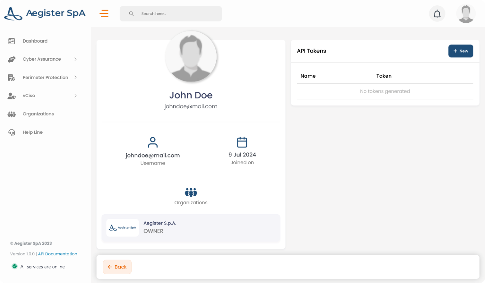
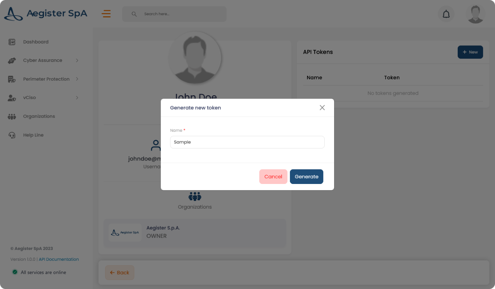
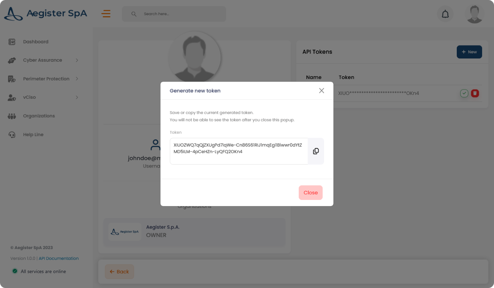

## How to Create a Token

Follow these steps to create a new token for authentication:

1. **Access your Profile**  
   Click on your profile icon located at the top right corner of the page or navigate directly [here](https://app.aegister.com/settings/profile/).

2. **Create a New Token**  
   Click on the *+ New* button in the API Tokens section.
   

3. **Input Token Name**  
   Enter a name for your token in the input field and click on the "Generate" button.
   

4. **Copy the Token**  
   Copy the generated token as it will not be available again after this step.
   

Make sure to store the token securely, as it will be required for authenticating your API requests.
