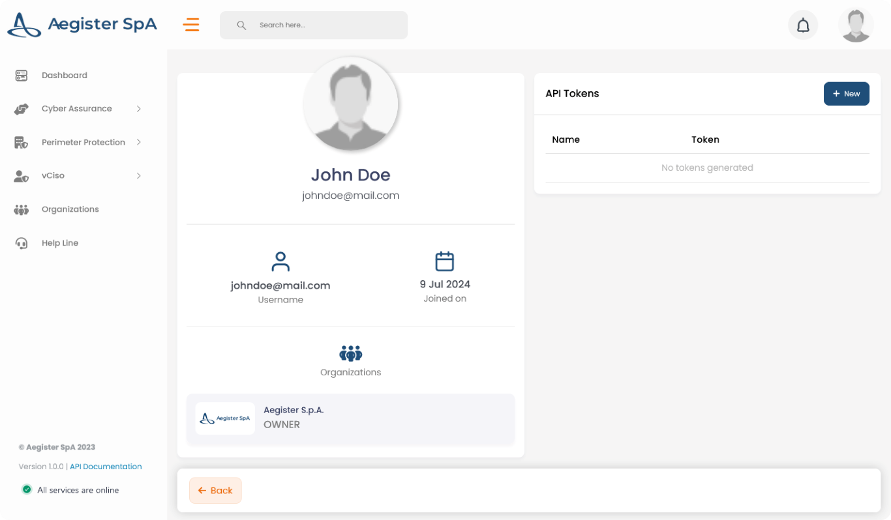
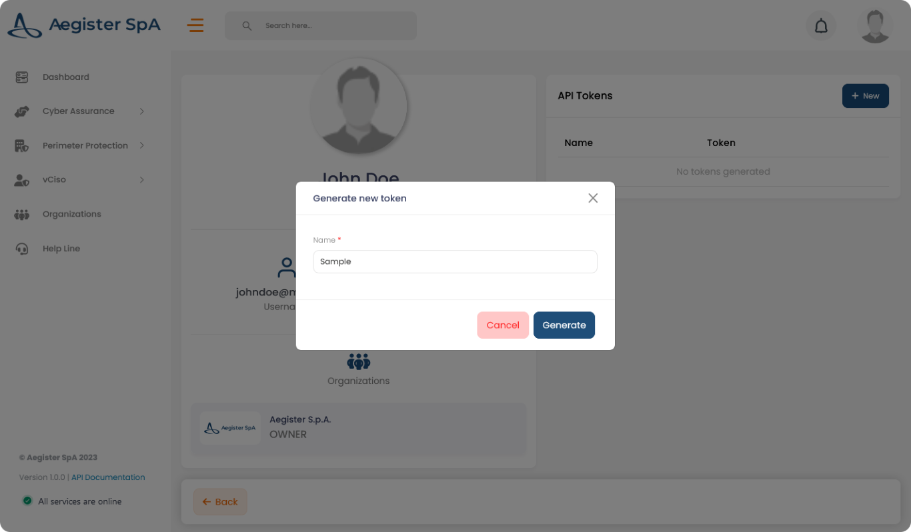
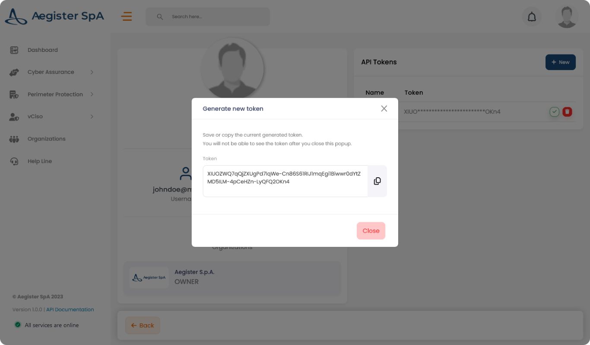

## How to Create a Token

Create an authentication token in four steps:

1. **Open your profile**  
   Click your profile icon at the top right of the page, or go directly to [Settings → Profile](https://app.aegister.com/settings/profile/).

2. **Create a new token**  
   In the API Tokens section, click *+ New*.
   

3. **Name the token**  
   Enter a name and click "Generate".
   

4. **Copy the token**  
   Copy the token now. It will not appear again.
   

Store the token securely. Every API request requires it.
