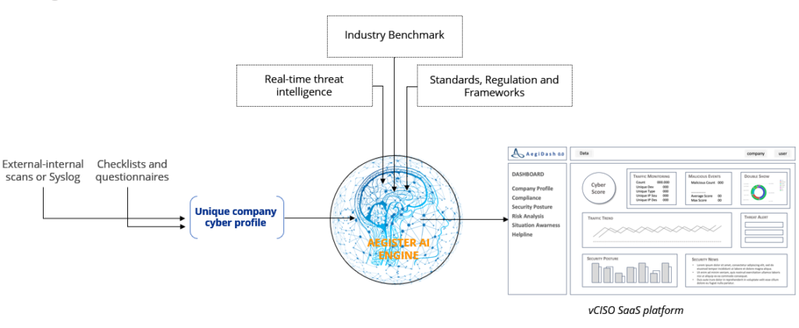

**vCISO Services**  
Aegister offers virtual Chief Information Security Officer (vCISO) services to manage cybersecurity strategies and mitigate risks effectively. This service is designed to help businesses implement and maintain robust cybersecurity measures without the need for a full-time in-house CISO.

**Threat Blocker**  
Aegister provides a hardware device known as Threat Blocker for perimeter security. This device integrates threat intelligence and IP reputation algorithms to enhance network security by blocking potential threats at the perimeter.

**Add-Ons**  
Aegister also offers a range of additional services, including:
- Data Protection Officer (DPO) services
- Workforce training on cybersecurity practices
- Fractional vCISO for part-time security leadership
- Forensic investigation to analyze and respond to security breaches
- Security council meetings for regular updates and strategy sessions
- Custom reporting tailored to specific business needs

Aegister's platform leverages artificial intelligence to enhance security measures, providing comprehensive and adaptable solutions to meet various business requirements.

For more information, visit [Services](https://aegister.com/en/it-services/index.html)