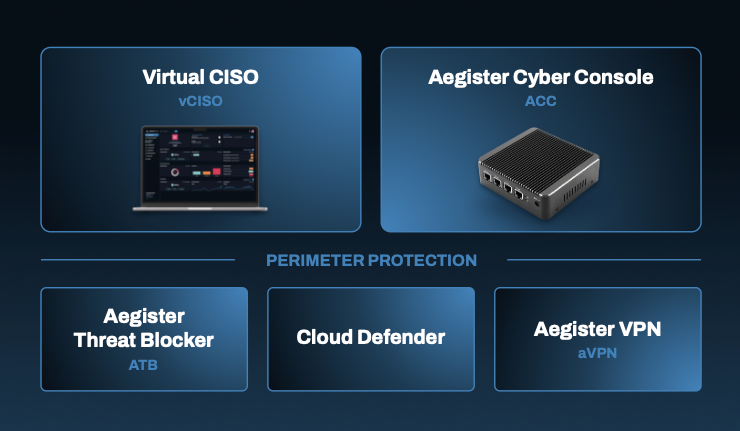

### Virtual CISO (vCISO)  
La soluzione principale è il servizio integrato **Virtual CISO**, una piattaforma web utile alle aziende che non intendono assumere un CISO full-time interno.  
È supportata da un team di esperti altamente qualificati che offrono un supporto personalizzato per gestire i rischi, la conformità e lo sviluppo di policy di sicurezza.  
Inoltre, possono essere installati i seguenti servizi di protezione.

---

## **Value Proposition della Tecnologia Aegister**

### 🚀 Elevata automazione  
I servizi di Aegister sono strutturati in modo tale da garantire alle imprese un elevato livello di sicurezza informatica grazie a un sistema di automazione e un modello di **threat detection** attivo **h24**.

### 👨‍💻 Team di esperti h24  
Il ricorso al **vCISO** di Aegister permette alle imprese di focalizzarsi sul proprio **core business**, senza doversi preoccupare della sicurezza informatica dei propri sistemi.

### 🔗 La forza del network  
La **Crowd Security** o **“Alleanza”** consente ai clienti di condividere le minacce **in tempo reale**.  
Aegister è tra i pochi operatori che dispone di un sistema di **threat intelligence proprietario**.

### 🤖 A.I. powered system  
La piattaforma Aegister sfrutta **algoritmi personalizzabili** e **metodi di Intelligenza Artificiale**, garantendo un **progressivo miglioramento** della sicurezza e delle capacità di difesa.

---

Per maggiori informazioni, visita [Servizi](https://aegister.com/en/solutions/).